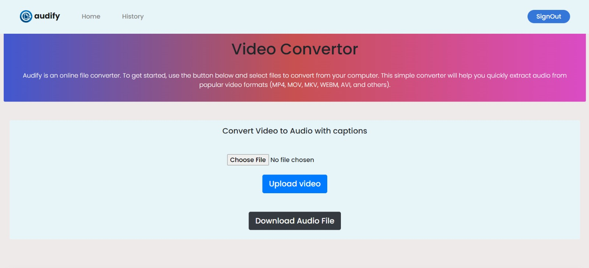

<h1>Audify</h1>

 Developed a web application for converting video files in various formats to audio and where the user can download the
audio clips in the formats like mp3. 
Designed and implemented an intuitive user interface for the video converter, ensuring a user-friendly experience and
integrated FFmpeg for handling the actual video conversion process. 
Technologies Used: HTML, CSS, NodeJS for backend functionality, EJS as a template language and MongoDB to store.

Audify is an online file converter. To get started, use the button below and select files to convert from your computer. This simple converter will help you quickly extract audio from popular video formats (MP4, MOV, MKV, WEBM, AVI, and others).
 

<h2>📸 Pages of our Audify Web Application are:</h2>

Homepage

Login

Convert

History

<h2>👇 Implementing features like:</h2>

<ul>
<li>User can quickly extract the audio from the video file.</li>
 
<li>User can sign up and log in by Google account.</li>
 
<li>The converted data is saved in the user history and the user can delete it.</li>
 
</ul>

<h2>🏄 How to run the project :</h2>

  1. Pre-requisites
    <ul>
    <li> HTML </li>
    <li> CSS </li>
    <li> NodeJS </li>
    <li> MongoDB </li>
    <li> FFmpeg </li>
    </ul>
  2. Setting Up
    <ul>
    <li> Clone the project from GitHub repo </li>
    <li> Run the code through "Live Server"</li>
    <li> It will run on http://localhost:3000</li>
    </ul>
